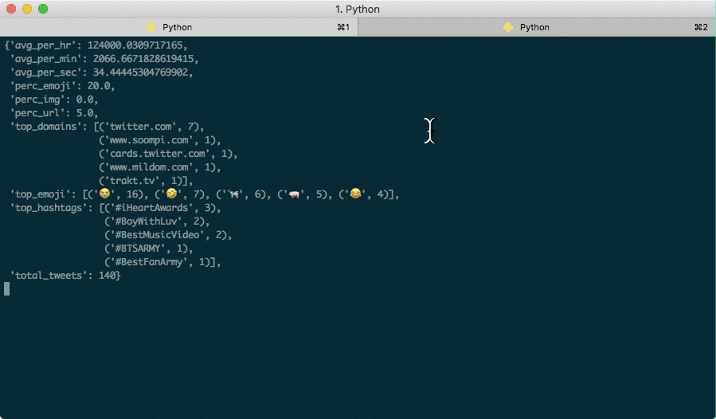

# twitter-statistics

 An application that connects to the Tweets API and processes incoming tweets to compute various statistics.

## Requirements

1. An approved [Twitter dev account](https://developer.twitter.com/en/apply)
2. An existing Twitter developer app in your account's [Twitter app dashboard](https://developer.twitter.com/en/apps)

## Docker

1. Install Docker.
2. Get your consumer key and consumer secret from the [Twitter App Dashboard](https://developer.twitter.com/en/apps). (Details>>Keys and tokens).
3. Store your Twitter consumer key as a local environment variable named `KEY`.

   `export KEY='YOUR_CONSUMER_API_KEY'`

4. Store your Twitter consumer secret as a local environment variable named `SECRET`.

   `export SECRET='YOUR_CONSUMER_API_SECRET'`
5. Clone this repo.
6. `cd` to the directory of the project.
7. Run `docker-compose run banno`.

## No Docker

1. Install Python 3.7.4
1. Get your app's consumer key and consumer secret from the [Twitter App Dashboard](https://developer.twitter.com/en/apps). (Details>>Keys and tokens).
3. Store your Twitter consumer key as a local environment variable named `KEY`.

   `export KEY='YOUR_CONSUMER_API_KEY'`

4. Store your Twitter consumer secret as a local environment variable named `SECRET`.

   `export SECRET='YOUR_CONSUMER_API_SECRET'`
4. Clone this repo.
5. `cd` to the directory of the project.
6. Run `pip install requests emoji requests_async`.
7. Execute the Python script with `python banno.py -run` and watch the console.

## Interesting Things

1. There aren't many tweets containing direct URLs to image files these days.
2. Async is processing is performed via [requests_async](https://github.com/encode/requests-async#streaming-responses--requests) and [asyncio](https://docs.python.org/3/library/asyncio.html)

## Culture

More important than tooling or automation is culture. You can use Kubernetes and CI/CD automation, but none of it will work without making decisions about your product's development process and team culture.

For this repository the decision was made that the development team would perform development on versioned branches instead of directly to master.  Releases are not entirely automatic, however when a PR for a development branch is approved and merged, a release is generated based on that version number.

## Automation Overview

All automations are handled by Github Actions.

* Continuous Integration
* Continuous Deployment
* Python Linting
* Integration Testing
* Automated Versioning
* Documentation Generation
* CHANGELOG Generation
* Mutation Testing

## Branch Protection

Pushing directly to mater is prohibited by anyone.  A separate branch (a "development branch") needs to be created, and then a PR to merge a development branch into master will need to be reviewed.

## Continuous Integration

Continuous integration is performed by GitHub actions. To view the latest actions and whether they have passed or not click the `Actions` button at the top of the repo.

Tests are executed on every commit with `pytest` and are located in `test_banno.py`.

## Linting

Python linting is also performed with GitHub actions and utlizes `Flake8`. Linting is performed on every commit.